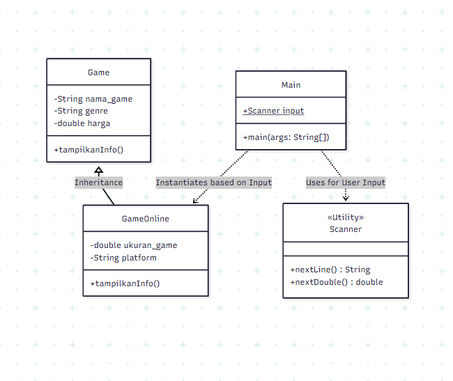

# TUGAS STRUKDAT

# RHEZA PRAMUDITA ADI PUTRA
# 5027251090

# Sistem Manajemen Koleksi Game (Java OOP)

Tugas Strukdat OOP Pendataan Koleksi Game

# DIAGRAM

```mermaid
classDiagram
    class Game {
        -String nama_game
        -String genre
        -double harga
        +tampilkanInfo()
    }

    class GameOnline {
        -double ukuran_game
        -String platform
        +tampilkanInfo()
    }

    class Main {
        +main(args: String[])
        +Scanner input$
    }

    class Scanner {
        <<Utility>>
        +nextLine() String
        +nextDouble() double
    }

    Game <|-- GameOnline : Inheritance
    Main ..> GameOnline : Instantiates based on Input
    Main ..> Scanner : Uses for User Input

    


    # PENJELASAN

    1. Encasulation
    Prinsip ini saya terapkan dengan membungkus data-data penting di dalam kelas agar tidak bisa diakses secara langsung dari luar. Dalam kode Game.java, saya menggunakan akses private pada atribut seperti nama_game, genre, dan harga. Hal ini dilakukan untuk menjaga keamanan dan integritas data, sehingga nilai variabel tersebut tidak bisa diubah sembarangan oleh kelas lain. Sebagai gantinya, saya menyediakan "pintu akses" melalui Constructor untuk pengisian data di awal, serta method Getter dan Setter jika pengguna ingin mengambil atau memperbarui informasi tersebut secara terkontrol.

    2. Inheritance
    Saya menerapkan Inheritance untuk menciptakan hierarki antar kelas dan efisiensi kode. Kelas GameOnline dibuat sebagai anak (subclass) yang mewarisi sifat dari kelas Game sebagai induk (superclass) melalui kata kunci extends. Dengan cara ini, GameOnline secara otomatis memiliki atribut nama_game, genre, dan harga tanpa perlu menulis ulang kodenya dari nol. Saya hanya perlu fokus menambahkan atribut unik yang spesifik untuk game online, yaitu ukuran_game dan platform, sehingga struktur kode menjadi lebih rapi dan terorganisir.

    3. Polymorphism
    Prinsip Polimorfisme yang saya gunakan adalah jenis Method Overriding, yang terlihat pada method tampilkanInfo(). Meskipun method ini sudah ada di kelas induk, saya mendefinisikannya kembali di kelas GameOnline menggunakan anotasi @Override. Tujuannya adalah agar method tersebut memiliki perilaku yang lebih spesifik. Di dalam kelas anak, saya memanggil fungsi dasar dari induk menggunakan super.tampilkanInfo(), lalu menambahkan baris perintah tambahan untuk mencetak ukuran file dan platform. Ini memungkinkan satu nama method yang sama memberikan hasil berbeda tergantung pada objek mana yang memanggilnya.